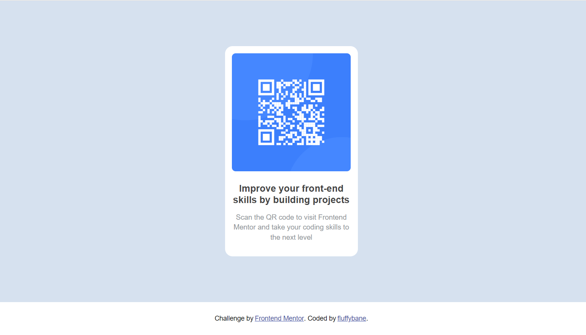

# Frontend Mentor - QR code component solution

This is a solution to the [QR code component challenge on Frontend Mentor](https://www.frontendmentor.io/challenges/qr-code-component-iux_sIO_H). Frontend Mentor challenges help you improve your coding skills by building realistic projects. 

## Table of contents

- [Frontend Mentor - QR code component solution](#frontend-mentor---qr-code-component-solution)
  - [Table of contents](#table-of-contents)
  - [Overview](#overview)
    - [Screenshot](#screenshot)
    - [Links](#links)
  - [My process](#my-process)
    - [Built with](#built-with)
    - [What I learned](#what-i-learned)
    - [Continued development](#continued-development)
    - [Useful resources](#useful-resources)
  - [Author](#author)

**Note: Delete this note and update the table of contents based on what sections you keep.**

## Overview

### Screenshot



### Links

- Solution URL: [FrontEnd Mentor](https://www.frontendmentor.io/solutions/qr-code-component-sass-bem-bcrSQHRsbg)
- Live Site URL: [GitHub Pages](https://fluffybane.github.io/qr-code-component/)

## My process

### Built with

- Semantic HTML5 markup
- BEM class naming convention
- CSS custom properties
- Flexbox
- Sass
- Mobile-first workflow

### What I learned

Starting with the HTML structure of the page helps to give an idea of how the CSS will look and the classes that will be required.

A few of my favourite code snippets:

```html
<div class="card">
  
  <h1 class="card__title">Improve your front-end skills by building projects</h1>
  <p class="card__text">Scan the QR code to visit Frontend Mentor and take your coding skills to the next level</p>
</div>
```
```css
:root {
	--font-family: "Outfit", sans-serif;
	--font-size-paragraph: 15px;

	--border-radius-outer: 16px;
	--border-radius-inner: 8px;
	--padding: 15px;

	--color-card-bg: hsl(0, 0%, 100%);
	--color-page-bg: hsl(212, 45%, 89%);
	--color-text-dark: hsl(0, 0%, 27%);
	--color-text-grey: hsl(220, 15%, 55%);
}
```

### Continued development

I would like to refine my process for the initial setup of a project. I'd also like to try creating a group of QR code cards using CSS Grid.

### Useful resources

- [Example resource 1](https://www.example.com) - This helped me for XYZ reason. I really liked this pattern and will use it going forward.
- [Example resource 2](https://www.example.com) - This is an amazing article which helped me finally understand XYZ. I'd recommend it to anyone still learning this concept.

**Note: Delete this note and replace the list above with resources that helped you during the challenge. These could come in handy for anyone viewing your solution or for yourself when you look back on this project in the future.**

## Author

- Website - [My Portfolio](https://fluffybane.github.io/portfolio-site/)
- Frontend Mentor - [@FluffyBane](https://www.frontendmentor.io/profile/FluffyBane)
